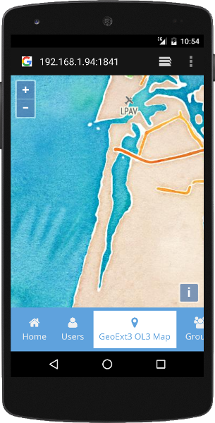

# GeoExt 3 Universal App

Follow these instructions to build your first GeoExt 3 application, using Sencha `cmd`. Supported versions:

* Sencha Cmd v6.2.1.29
* ExtJS GPL 6.2.0 (ext.version.number=6.2.0.981)
* GeoExt 3 (2016-10-20)

We will create a basic GeoExt 3 based universal app. A universal app should use both the classic and modern toolkit to work on desktop and mobile browsers. At the end of this exercise, you should have an application displaying a OpenLayers 4 map on a panel, both on the desktop and mobile browser.

## ExtJS Universal App

Let's review the Sencha `cmd` used to create a basic universal app.

Install [Sencha Cmd](https://www.sencha.com/products/extjs/cmd-download/).

Download ExtJS 6 GPL ([version ext-6.2.0](https://www.sencha.com/legal/gpl/)). Unzip it, and store it somewhere on your file system, like `/somewhere/ExtJS 6/ext-6.2.0/`.

To create a universal ExtJS 6 based app, do:

```
cd ~/WebstormProjects
sencha -sdk "/somewhere/ExtJS 6/ext-6.2.0/" generate app MyApp MyApp
cd MyApp
sencha app watch
```

## Preview the ExtJS Universal App

The last Sencha command `sencha app watch` will start a local service at port 1841 to serve your application.

```
(...)
[INF] Application available at http://localhost:1841
[INF] Waiting for changes...
```

When you see `Waiting for changes...`, open the browser using [http://localhost:1841/](http://localhost:1841/) or [http://localhost:1841/?profile=modern](http://localhost:1841/?profile=modern) to see the mobile enabled version.

Press `CONTROL-C` to end the local server.

## GeoExt 3 Universal App

Let's do it! Please make sure that you are able to create the ExtJS Universal App as described. The process to create our first GeoExt 3 is quite similar. The previous app was created to make sure you have all the ExtJS setup up and running.

You already have Sencha cmd and ExtJS 6 working. Let's start with a basic ExtJS application.

```
cd ~/WebstormProjects
sencha -sdk "/somewhere/ExtJS 6/ext-6.2.0/" generate app MyGeoExtApp MyGeoExtApp
cd MyGeoExtApp/
sencha app watch
```

When you see `Waiting for changes...`, open the browser using [http://localhost:1841/](http://localhost:1841/) and [http://localhost:1841/?profile=modern](http://localhost:1841/?profile=modern) to make sure the basic app is running.

If the application is running properly, you can stop the web server with `CONTROL-C` and move on.

### Add GeoExt 3 to your app

Since [GeoExt v3.0.0](https://github.com/geoext/geoext3/releases/tag/v3.0.0) it is strongly recommended that app devs use GeoExt 3 via git clone, especially if the latest (and greatest) version should be used.

Alternatively the released versions are published as [ExtJS package](http://docs.sencha.com/cmd/6.x/cmd_packages/cmd_packages.html). They can be used as any other ExtJS package, taking advantage of Sencha cmd.

#### Use GeoExt 3 from a git clone (recommended)

Clone the latest GeoExt 3 code from the official github repository:
```
mkdir lib
cd lib
git clone https://github.com/geoext/geoext3.git
cd ..
```

Adjust the `classpath` property in your ``app.json`` like below.
```
"classpath": [
    "app",
    "${toolkit.name}/src",
    "./lib/geoext3/src"
],
```

#### Use GeoExt 3 as ExtJS package

The released version of GeoExt 3 are available as a ExtJS package. We need to tell Sencha cmd where it can find the `GeoExt3` package.

```
sencha package repo add GeoExt http://geoext.github.io/geoext3/cmd/pkgs
```

Sencha cmd can be used to check that GeoExt repository is known. Later Sencha cmd will fetch the GeoExt 3 package from the repository to build our application.

```
sencha repository list
```

You should get something like:

```
Sencha Cmd v6.2.1.29
[INF] Remote repository connections (3):
[INF]
[INF]     sencha - http://cdn.sencha.com/cmd/packages/
[INF]     GeoExt - http://geoext.github.io/geoext3/cmd/pkgs/
[INF]     font-awesome - http://geoext.github.io/geoext3/cmd/pkgs/
```
Add the following GeoExt 3 path `"packages/remote/GeoExt/src"` to the `classpath`:

```
  "classpath": [
    "app",
    "${toolkit.name}/src",
    "packages/remote/GeoExt/src"
  ],
```

##### Add GeoExt to the requires section

Change the ```builds``` section, adding `requires` to the `"classic"` build:

```
    "builds": {
        "classic": {
            "toolkit": "classic",
            "theme": "theme-triton",
            "sass": {
                // "save": "classic/sass/save.scss"
            },
            "requires": [
                "GeoExt"
            ]
        },
        "modern": {
            "toolkit": "modern",
            "theme": "theme-triton",
            "sass": {
                // "save": "modern/sass/save.scss"
            }
        }
    },
```

Note: Do not change the global `requires`:

```
    "requires": [
        "font-awesome"
        // "GeoExt" // not here, put it under builds/classic/requires
    ],
```

### Adding a new view

We need a new view to display a map. Use the following Sencha cmd to create a default view.

```
sencha generate view main.Map
```

This creates 3 new files, under `app/view/main/`. None is created under `classic/src/view/main/` or `modern/src/view/main/`.

```
app/view/main/Map.js
app/view/main/MapController.js
app/view/main/MapModel.js
```

### Changing the newly created view

We need to change the view created by `sencha generate view main.Map` in the previous step.

Four modifications are necessary.
The view should:
 - extend `GeoExt.component.Map` instead of `Ext.panel.Panel`
 - have an `xtype: 'mappanel'` assigned, needed for future reference
 - needs an additional `map` property initialized
 - discard the default `html` property

The entire `app/view/main/Map.js` should be:

```js
Ext.define("MyGeoExtApp.view.main.Map",{
    // extend: "Ext.panel.Panel",
    extend: "GeoExt.component.Map",
    xtype: 'mappanel',
    requires: [
        "MyGeoExtApp.view.main.MapController",
        "MyGeoExtApp.view.main.MapModel"
    ],
    controller: "main-map",
    viewModel: {
        type: "main-map"
    },
    // html: "Hello, World!!"
    map: new ol.Map({
        layers: [
            new ol.layer.Tile({
                source: new ol.source.Stamen({
                    layer: 'watercolor'
                })
            }),
            new ol.layer.Tile({
                source: new ol.source.Stamen({
                    layer: 'terrain-labels'
                })
            })
        ],
        view: new ol.View({
            center: ol.proj.fromLonLat( [-8.751278, 40.611368] ),
            zoom: 12
        })
    })
});
```

### Include the new view in the existing tab panel

The base application display a tab panel, both on the classic and modern based toolkit.

To display our new map, we need to change both `classic/src/view/main/Main.js` and `modern/src/view/main/Main.js`.

Add a new tab to `classic/src/view/main/Main.js` to the `items` property, after the tab with `title: 'Users'`. It will become:

```js
    }, {
        title: 'Users',
        iconCls: 'fa-user',
        bind: {
            html: '{loremIpsum}'
        }
    }, {
        title: 'GeoExt3 OL3 Map',
        iconCls: 'fa-map-marker',
        layout: 'fit',
        items: [{
            xtype: 'mappanel'
        }]
    }, {
```

Add the same new tab to `modern/src/view/main/Main.js`. It will become:

```js
        }, {
            title: 'Users',
            iconCls: 'fa-user',
            bind: {
                html: '{loremIpsum}'
            }
        }, {
            title: 'GeoExt3 OL3 Map',
            iconCls: 'fa-map-marker',
            layout: 'fit',
            items: [{
                xtype: 'mappanel'
            }]
        }, {
```

These are all the changes to the code.
Now we need to tell how to build our application with the GeoExt package and load the necessary OpenLayers library.

### Adjust app.json

The file `app.json` must be adjusted before we can build the application.

Two small changes are necessary.

#### Add the OpenLayers 4 library

The application needs the OpenLayers library to work. Add this dependency to the `js` property.

```
  "js": [{
      "path": "https://openlayers.org/en/v4.6.5/build/ol.js",
      "remote": true
    }, {
      "path": "app.js",
      "bundle": true
    }],
```

and css file

```
    "css": [
        {"path": "https://openlayers.org/en/v4.6.5/css/ol.css" , "remote": true},
        {
            // this entry uses an ant variable that is the calculated
            // value of the generated output css file for the app,
            // defined in .sencha/app/defaults.properties
            "path": "${build.out.css.path}",
            "bundle": true,
            "exclude": ["fashion"]
        }
    ],
```

This includes all OpenLayers 4 functionality. After this exercise, you can consider [creating a custom build](https://openlayers.org/en/v4.6.5/doc/tutorials/custom-builds.html) to create a smaller OpenLayers 4 library, adjusted to only what you need.

### Build and test the app

Start by doing:

```
sencha app refresh
```

Since we need the GeoExt package (added to the "requires" in `app.json`), the previous command will download the package and installs it under `packages/remote/GeoExt` (only in case you [installed GeoExt as ExtJS package](#use-geoext-3-as-extjs-package)).
Make sure you have this folder added to your local application.

If you have some error reported, double check the changes you made. Confirm that you do not have syntax errors in `app.json`.

If everything went fine, you can start the application with:

```
sencha app watch
```

Open the browser using [http://localhost:1841/](http://localhost:1841/) and [http://localhost:1841/?profile=modern](http://localhost:1841/?profile=modern) to test the app.

To open the application on a mobile device connected to the same local network, find out your computer's IP address and open that IP on the mobile browser, followed by the port number 1841, like [http://192.168.1.94:1841](http://192.168.1.94:1841). The mobile will open the mobile version automatically.

The following screenshots shows the result, for the classic (running on desktop browser) and modern toolkit (running on mobile).




### Celebrate and share

Congratulations! Celebrate and share your accomplishment!

### What Went Wrong?

If you are unable to get this GeoExt 3 app up and running, check the Sencha cmd output for errors. Also check the browser inspector/development tools to find any errors if you don't see the map.

Check the sources, which are also available on [Github](https://github.com/jgrocha/MyGeoExtApp).

### Further development

Of course you can extend the newly created application by adding more and more components.
